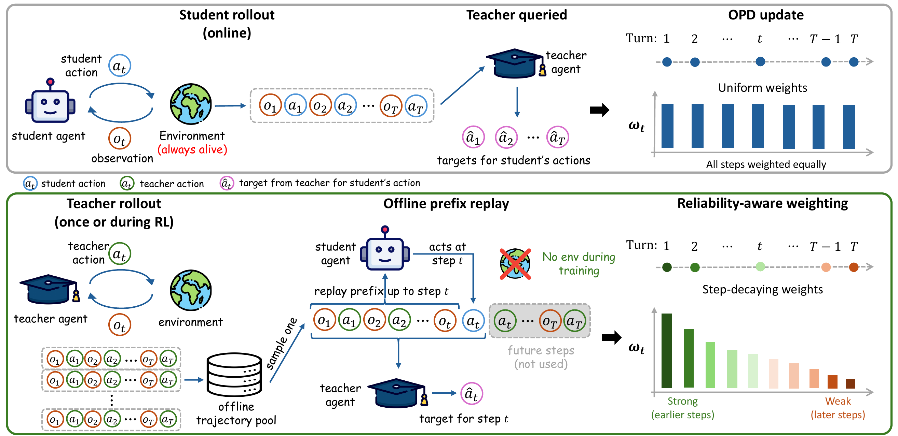
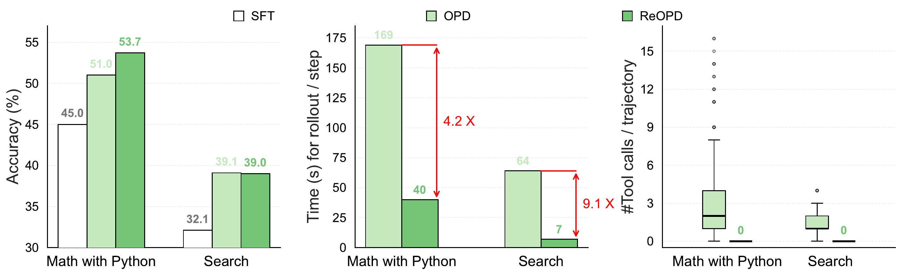
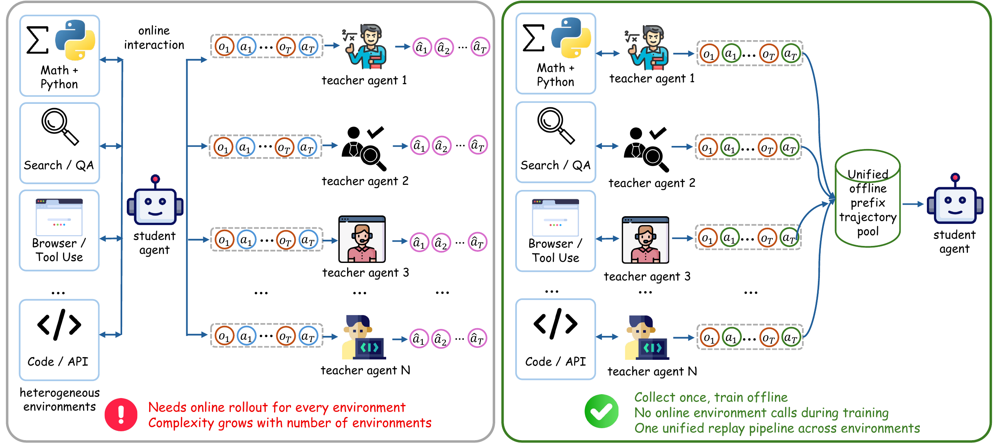

<div align="center">

## Multi-Turn On-Policy Distillation with Prefix Replay

ReOPD distills a teacher agent into a student **without any environment interaction during student training**: the student acts on prefixes replayed from pre-collected teacher trajectories, while the teacher provides dense per-step supervision. It matches or improves online OPD accuracy with **zero tool calls** and **≥4× faster rollouts** during training.

<p align="center">
  <a href="https://arxiv.org/abs/2607.04763"></a>
  <a href="https://baohaoliao.github.io/ReOPD/"></a>
  <a href="https://github.com/BaohaoLiao/ReOPD"></a>
  <a href="https://huggingface.co/collections/baohao/reopd"></a>
</p>

</div>

## 🔥 News

- **[07/2026]** ReOPD reproduction code is released!

## 🌟 Overview

<div align="center">

</div>

Fully online on-policy distillation (OPD, top) is costly for agentic tasks: every update re-rolls the student through a live environment and queries the teacher at each visited history. ReOPD (bottom) replays a **teacher-forced prefix** from an offline trajectory pool — collected for free during the teacher's RL training — and lets the student act only at the supervised step. Because multi-turn OPD suffers a **two-sided distribution shift** (student occupancy vs. teacher reliability), ReOPD applies a **step-decaying schedule** that emphasizes early, low-shift prefixes: positions are sampled with probability `p_t ∝ κ^t` (κ = 0.6) at data-processing time, so the training loss itself stays unchanged.

<div align="center">

</div>

ReOPD keeps the accuracy benefits of OPD while removing environment interaction: it matches or improves OPD accuracy, trains 4–9× faster per rollout step, and uses zero tool calls during student training (student/teacher: Qwen3-4B-Instruct-2507 / Qwen3-8B).

<div align="center">

</div>

The offline pool also decouples environments from training: trajectories from heterogeneous environments (math + Python, search/QA, ...) are collected separately by domain-specific teachers and merged into one pool, so a single student can be distilled jointly without keeping all environments online.

## 📂 Repository Layout

```text
ReOPD/
  data/          # Data preparation: prefix-pool construction, prompt mixing
  train/         # Training: multi-teacher OPD/ReOPD on math (ReTool) + search (Search-R1)
  eval/
    math/        # Python-tool math eval (AIME24/25, AMC23, Minerva, Olympiad, MATH500)
    search/      # Retrieval QA eval (NQ, TriviaQA, PopQA, HotpotQA, 2Wiki, Musique, Bamboogle)
  tools/         # HF <-> Megatron torch_dist checkpoint converters
  third_party/
    slime        # Training framework (submodule)
```

## 📦 Installation

Our code is based on our [slime fork](https://github.com/BaohaoLiao/slime) (included as a submodule). Install the base training environment first, then the task-specific extras for the environment(s) you want to run.

### 1. Base environment (slime)

Set up the slime environment following slime's official [quick-start guide](https://github.com/THUDM/slime/blob/main/docs/en/get_started/quick_start.md) (PyTorch with CUDA, Ray, SGLang, Megatron-LM, and the recommended Docker image).

> **Note:** slime's default images target H100/H800 (SM90). For **A100** GPUs, follow [THUDM/slime#1832](https://github.com/THUDM/slime/pull/1832), which adds an A100 patch set (`v0.5.9.a100`), an offline-friendly conda build (`build_conda.a100.sh`), and `docker/Dockerfile.a100`.

Then install ReOPD on top, replacing the slime checkout with our fork:

```bash
git clone https://github.com/BaohaoLiao/ReOPD.git
cd ReOPD
git submodule update --init --recursive
pip install -r requirements.txt
pip install -e third_party/slime --no-deps
```

### 2. Math with Python (ReTool) task

The Python tool sandbox runs inside the training environment; its dependencies (`jupyter_client`, `ipykernel`, `psutil`, `sympy`, ...) are already covered by `requirements.txt`. No extra installation is needed.

### 3. Search (Search-R1) task

Install the [Search-R1](https://github.com/PeterGriffinJin/Search-R1) dependencies in the training environment:

```bash
pip install chardet tensordict
git clone https://github.com/PeterGriffinJin/Search-R1.git && cd Search-R1
pip install -e . --no-deps
```

The local dense retriever needs a **separate conda environment** to avoid conflicts with the training stack:

```bash
conda create -n retriever python=3.10 -y
conda activate retriever
conda install pytorch==2.4.0 pytorch-cuda=12.1 -c pytorch -c nvidia -y
pip install "transformers==4.46.3" datasets pyserini huggingface_hub uvicorn fastapi
```

Install faiss with GPU support. On A100 (SM80) the PyPI wheel works (`pip install faiss-gpu-cu12`); on H100 (SM90) build faiss v1.9.0 from source with `-DCMAKE_CUDA_ARCHITECTURES="80;90"` (see [faiss install docs](https://github.com/facebookresearch/faiss/blob/main/INSTALL.md)).

## ⚡ Training

ReOPD follows a three-stage protocol per environment:

1. **Cold start (SFT)** — teach the base model tool use and output format.
2. **Teacher GRPO** — train the teacher with RL; its on-policy rollouts are saved and become the replayed-prefix pool for free.
3. **Student distillation (ReOPD)** — fan the pooled trajectories into per-turn prefix data with the step-decay sampling schedule (`data/`), then train the student with the teacher's per-token logprobs as target (`train/`).

### 1. Prepare data

See [`data/README.md`](data/README.md) for prefix-pool construction and [`train/README.md`](train/README.md) for prompt mixing across environments.

### 2. Distill

The trainer routes each sample by `metadata.task` to the matching rollout, reward, and frozen teacher, and attaches teacher logprobs in `sample.teacher_log_probs` for the reverse-KL OPD loss in slime:

```bash
export HF_CHECKPOINT=/path/to/student_hf
export REF_LOAD=/path/to/student_torch_dist
export SAVE_DIR=/path/to/output_run
export PROMPT_DATA=/path/to/mixed_or_prefix_data.jsonl
export RETOOL_TEACHER_URL=http://127.0.0.1:13141/generate
export SEARCH_R1_TEACHER_URL=http://127.0.0.1:13142/generate

bash train/scripts/run_multiteacher_opd.sh
```

Full documentation — single-environment ablations, teacher routing, and all environment variables — is in [`train/README.md`](train/README.md).

## 🎓 Evaluation

Math (start an SGLang server, then evaluate):

```bash
MODEL_PATH=/path/to/hf TP_SIZE=2 bash eval/math/sglang_serve.sh
MODEL_PATH=/path/to/hf DATASET=/path/to/aime-2024.jsonl bash eval/math/eval.sh
```

Search (also needs the local retrieval servers: e5 + 2018 Wikipedia dump):

```bash
DATA_DIR=/path/to/search_data bash eval/search/run_retrieval_server.sh
MODEL_PATH=/path/to/hf bash eval/search/sglang_serve.sh
MODEL_PATH=/path/to/hf DATASET=/path/to/test.parquet bash eval/search/eval.sh
```

## 📊 Main Results

Qwen3-8B teacher → Qwen3-4B-Instruct-2507 student (avg. accuracy):

| Method | Math (6 benchmarks) | Search (7 benchmarks) |
| --- | --- | --- |
| SFT (off-policy) | 45.0 | — |
| OPD (online) | 51.0 | 39.1 |
| **ReOPD (offline)** | **53.7** | 39.0 |

Gains are largest when the teacher–student gap is wide (math), and ReOPD matches OPD when the teacher stays reliable on student histories (search) — see the paper for all teacher/student scales and the multi-environment setting.

## 📝 Citation

If you find ReOPD useful, please cite as:

```bibtex
@misc{liao2026reopd,
      title={Multi-Turn On-Policy Distillation with Prefix Replay},
      author={Baohao Liao and Hanze Dong and Xinxing Xu and Li Dong and Christof Monz and Furu Wei},
      year={2026},
      eprint={2607.04763},
      archivePrefix={arXiv},
      primaryClass={cs.LG},
      url={https://arxiv.org/abs/2607.04763},
}
```

## 🙏 Acknowledgments

Our code is based on [slime](https://github.com/THUDM/slime) for training and [SGLang](https://github.com/sgl-project/sglang) for rollout and teacher serving. The math and search environments are adapted from [ReTool](https://arxiv.org/abs/2504.11536) and [Search-R1](https://github.com/PeterGriffinJin/Search-R1). We really appreciate their contributions to the community.
